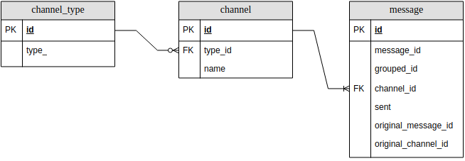

# telegram_posts_aggregator

Aggregate posts from several channels and send it via bot according the rules.

## Diagrams
### Overview

### DB model



## Setup environment

### Install dependencies

The project uses [Poetry](https://python-poetry.org/)  for dependency management. Please set up the project following the instructions in this [poetry guide](https://python-poetry.org/docs/basic-usage/#initialising-a-pre-existing-project).

### Set up Telegram entities

To facilitate a smooth development process, it's recommended to have two Telegram accounts. One can be your primary
private account and the other a test account. Due to Telegram's strict rules, it's strongly advised to treat the test
account as temporary and be prepared for the possibility of it being permanently banned.

Once you have both accounts set up, proceed to create a Telegram bot via BotFather at https://t.me/BotFather. You can
connect the bot with you main account.

After setting up the bot, create two new public channels: <br/>

1. Aggregation channel: This channel should include at least your second account, the bot, and your main account,
   the bot and the second account should be administrators.
2. Test channel (source channel): The bot should not be a member of this channel. This channel will serve to simulate a
   news channel.

Now for your test account you have to create a new application https://my.telegram.org/apps. Keep in mind that telegram
can ban this account for no reason [GitHub issue](https://github.com/lonamiwebs/telethon/issues/824)


### Environment variables

Create a .env file and fill in all required variables (see .env.example, it contains explanation for every field)
> Keep in mind that you can't use the same session in multiple applications simultaneously. So it's recommended to
> create a session for every application (local setup, container setup, etc.)

## Run the application in a container

```sh
make build
make up-all
```

## Run the application locally
Note: db should be in a container

poetry run

## DB migrations

### Create new migration:

`alembic revision --autogenerate -m <name>`

### Upgrade the database to the latest version

`alembic upgrade heads`

### Run unit tests

You can choose any approach to run unit tests. We provide here two of them. <br>
**Approach 1 (terminal):** run `python -m pytest tests` in your terminal from the source root. <br>
**Approach 2 (PyCharm):** [read here](https://www.jetbrains.com/help/pycharm/testing.html)


## Troubleshooting
If you have got ```Server sent a very new message with ID ``` when initializing the project, try to refresh your session
